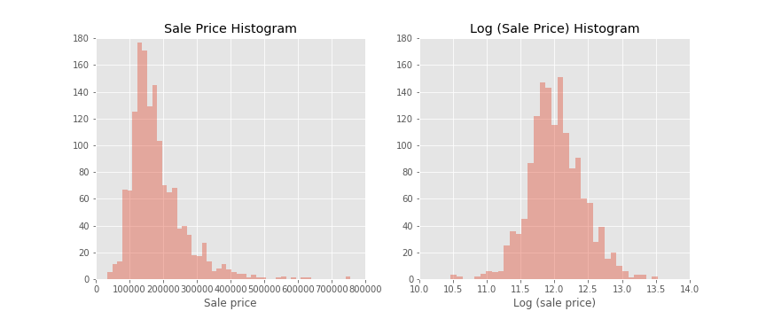
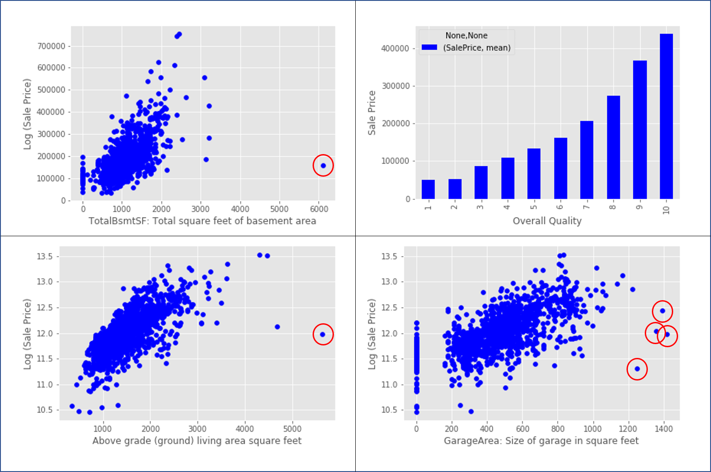
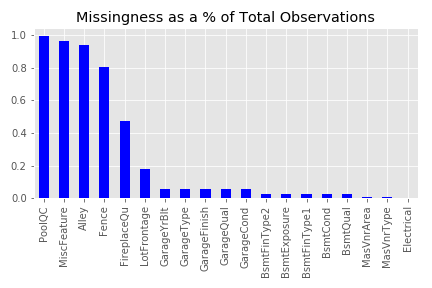
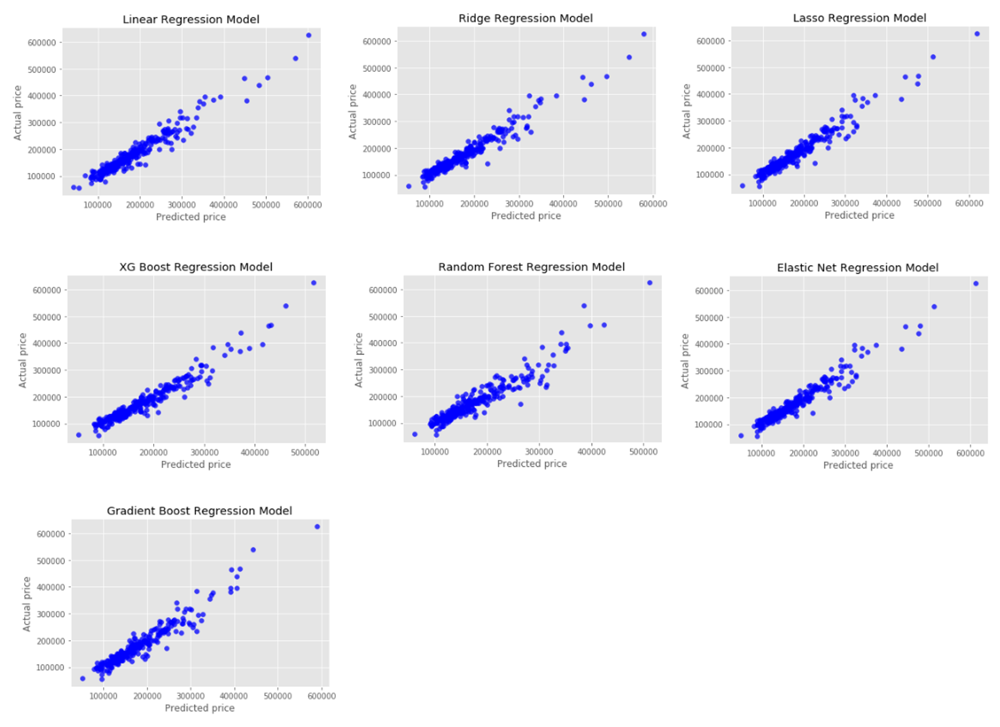
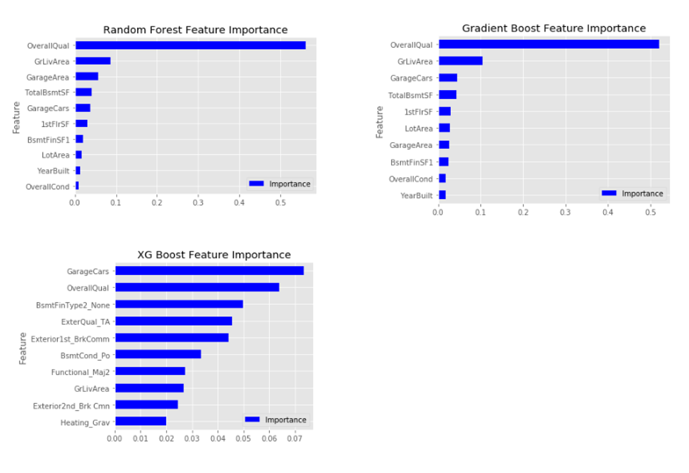
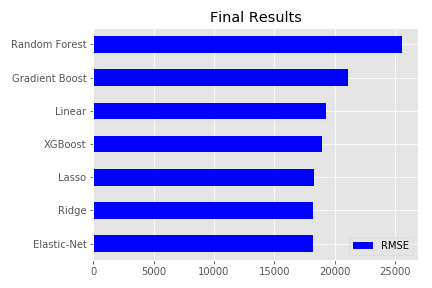

# house
# Predicting House Prices with Machine Learning

## Introduction
This project aims to predict  housing prices in Ames, Iowa using the Ames Housing dataset from the Kaggle Competition: [ House Prices: Advanced Regression Techniques ]. There are 79 different variables that describe almost every aspect of the home, from the number of rooms to the type of roof material. This project conducted an exploratory data analysis and model building using Linear, Ridge, Lasso, ElasticNet, Random Forest, Gradient Boosting, and XGBoost Regression.

## Exploratory Data Analysis
1. Transforming Skewed Distributions
2. Removing Outliers 
3. Remove and Impute Missing Data 
4. Dropping Correlated Variables to Avoid Multicollinearity

1. First, by looking at the target variable, 'Sale Price', the distribution is positively skewed, violating the assumption of Linear Regression, so I Log (Sale Price) to get a more normal distribution. I also look at the x-variable features that have high skewness and decide to apply a boxcox transformation for skewness greater than 0.65.

2. I look at both numerical and categorical variables to better understand the data and remove the outliers in the numerical data. Few variables are displayed below:

3. At first glance, there are quite alot of missing values, but many of them are missing because they simply do not have the feature. However I will drop PoolQC (Pool Quality), Misc. Features, Alley, Fence, and Fireplace Quality due to large amount of constants and I do not believe they are strong drivers of Sale Price. (Regression was tested with and without these features and model was better without)

PoolQC: NA = No Pool
Miscellaneous Feature: NA = No Miscellaneous Features
Alley: NA = No Alley
Fence: NA = No Fence
Fireplace Quality: NA = No Fireplace
Columns with 'Garage': NA = No Garage
Columns with 'Bsmt': NA = No Basement 

Lot Frontage: Imputed using 1stFlrSF
Columns with 'Mas': regarding Masonry Veneers. imputed with the mode. 
Electrical: imputed with the mode. only missing one. 

4. GarageYrBlt and Year Built have a 82.6% correlation. These two features have very similar, if not same, values in two columns, causing multicollinearity. I removed GarageYrBlt because some homes do not have a Garage and I believe Year Built will be a better indicator. 

After dummifying categorical features and train-test split, we are ready to move to Regression models.

## Regression Models
Linear, Ridge, Lasso, ElasticNet, Random Forest, Gradient Boosting, and XGBoost Regression were performed on this data and optimal hyperparameters were tuned using GridSearch. 

For Random Forest, Gradient Boosting, and XG Boost, Top 10 feature importances were generated. Overall Quality Scores, square footage of the general living area, and the car capacity of the garage contributed most to predicting sale price. 

 

## Results
In the end, Elastic Net performed the best followed by Ridge and Lasso regressions. All regressions had an root mean squared error of around 18,000, the amount of error an investor should expect the prediction to vary. 

 
